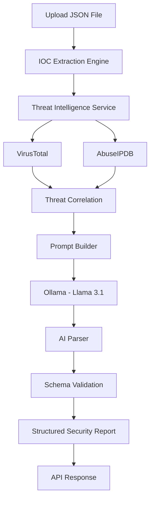

<div align="center">

# 🛡️ AegisAI

### AI-Powered Threat Intelligence & SOC Analysis Platform

Detect • Analyze • Correlate • Explain


---

An intelligent SOC analyst that combines Threat Intelligence, IOC Correlation and Local LLMs to generate structured security reports.

</div>

---

# 📖 Overview

AegisAI is an AI-powered cybersecurity platform that automates the early stages of Security Operations Center (SOC) investigations.

Instead of only extracting Indicators of Compromise (IOCs), AegisAI correlates indicators with multiple Threat Intelligence providers and generates structured AI-assisted security assessments using a locally hosted Large Language Model (LLM).

The project follows a modular, production-oriented backend architecture built with FastAPI and is designed to evolve into a complete SOC investigation platform.

---

# ✨ Features

## Current Features

- IOC Extraction Engine
- IP Validation & Normalization
- VirusTotal Integration
- AbuseIPDB Integration
- Threat Intelligence Correlation
- AI-Powered Threat Analysis
- Local LLM using Ollama (Llama 3.1)
- Structured AI Output
- FastAPI REST API
- Swagger Documentation
- Production Logging
- Centralized Exception Handling

---

# 🏗️ System Architecture



---

# ⚙️ Technology Stack

| Category | Technology |
|----------|------------|
| Language | Python 3.13 |
| Framework | FastAPI |
| AI | Ollama + Llama 3.1 |
| Threat Intelligence | VirusTotal API |
| Threat Intelligence | AbuseIPDB API |
| Validation | Pydantic v2 |
| HTTP Client | HTTPX |
| API Docs | Swagger UI |
| Testing | Python |
| Version Control | Git + GitHub |

---

# 📂 Project Structure

```text
AegisAI/
│
├── backend/
│   ├── app/
│   │   ├── ai/
│   │   ├── api/
│   │   ├── core/
│   │   ├── providers/
│   │   ├── schemas/
│   │   ├── services/
│   │   └── utils/
│   │
│   ├── tests/
│   ├── requirements.txt
│   └── .env.example
│
├── frontend/            # Coming Soon
│
├── docs/                # Coming Soon
│
└── README.md
```

---

# 🎯 Project Workflow

```text
Upload Log File

↓

Extract IOCs

↓

Threat Intelligence Lookup

↓

Risk Correlation

↓

Prompt Generation

↓

Local LLM Analysis

↓

Structured AI Report

↓

SOC Analyst Output
```

---
# 🚀 Getting Started

## Prerequisites

Before running AegisAI, ensure the following software is installed:

- Python 3.13+
- Git
- Ollama
- Llama 3.1 Model
- VirusTotal API Key
- AbuseIPDB API Key

---

# 📥 Installation

## 1. Clone the Repository

```bash
git clone https://github.com/aryansrivastav01/AegisAI.git

cd AegisAI/backend
```

---

## 2. Create Virtual Environment

```bash
python -m venv .venv
```

Linux / macOS

```bash
source .venv/bin/activate
```

Windows

```powershell
.venv\Scripts\activate
```

---

## 3. Install Dependencies

```bash
pip install -r requirements.txt
```

---

## 4. Install Ollama

Linux

```bash
curl -fsSL https://ollama.com/install.sh | sh
```

Verify Installation

```bash
ollama --version
```

---

## 5. Download Llama 3.1

```bash
ollama pull llama3.1:8b
```

Verify Model

```bash
ollama list
```

Expected Output

```text
NAME

llama3.1:8b
```

---

# ⚙️ Environment Configuration

Create a `.env` file inside the backend directory.

```env
APP_NAME=AegisAI
APP_VERSION=1.0.0
DEBUG=True

SECRET_KEY=change_this_secret_key
JWT_ALGORITHM=HS256

VIRUSTOTAL_API_KEY=your_api_key
ABUSEIPDB_API_KEY=your_api_key

OLLAMA_BASE_URL=http://localhost:11434
LLM_PROVIDER=ollama
OLLAMA_MODEL=llama3.1:8b
```

---

# ▶️ Running the Application

Start Ollama

```bash
ollama serve
```

> If Ollama is already running as a system service, you may see:
>
> `bind: address already in use`
>
> This is expected and means the service is already running.

---

Start FastAPI

```bash
uvicorn app.main:app --reload
```

---

Open Swagger

```
http://127.0.0.1:8000/docs
```

---

# 🧪 Running Tests

Run AI Test

```bash
python -m tests.test_ai
```

Run Threat Intelligence Test

```bash
python -m tests.test_threat_service
```

Run VirusTotal Test

```bash
python -m tests.test_virustotal
```

Run AbuseIPDB Test

```bash
python -m tests.test_abuseipdb
```

---

# 📡 API Endpoints

| Method | Endpoint | Description |
|----------|----------|-------------|
| GET | `/health` | Health Check |
| POST | `/upload` | Upload JSON and Generate AI Threat Report |

---

# 📤 Upload Workflow

1. Upload a JSON log file.
2. Extract Indicators of Compromise (IOCs).
3. Query VirusTotal and AbuseIPDB.
4. Correlate threat intelligence.
5. Generate a structured AI analysis using Ollama.
6. Return a JSON response containing:
   - IOC summary
   - Threat intelligence
   - AI-generated analysis

---
# 🤖 AI Analysis Pipeline

AegisAI uses a structured AI pipeline instead of directly sending uploaded data to a Large Language Model.

Each stage validates, enriches and transforms data before AI analysis.

```text
Upload JSON
      │
      ▼
IOC Extraction
      │
      ▼
Threat Intelligence
      │
      ▼
Risk Correlation
      │
      ▼
Prompt Builder
      │
      ▼
Ollama (Llama 3.1)
      │
      ▼
AI Parser
      │
      ▼
Schema Validation
      │
      ▼
Structured Security Report
```

---

# 🛡 Threat Intelligence Pipeline

The platform enriches Indicators of Compromise (IOCs) using multiple intelligence providers.

Current Providers

- VirusTotal
- AbuseIPDB

Future Providers

- AlienVault OTX
- MISP
- GreyNoise
- Shodan
- URLHaus
- MalwareBazaar

---

# 📊 AI Output

The AI engine produces structured JSON instead of plain text.

Example

```json
{
    "summary": "No malicious indicators were identified.",
    "overall_risk": "Low",
    "confidence": 95,
    "findings": [],
    "recommendations": [
        "Continue monitoring network activity."
    ]
}
```

---

# 📸 Screenshots

## Swagger API

> _Coming Soon_

```
docs/images/swagger.png
```

---

## AI Threat Report

> _Coming Soon_

```
docs/images/ai-report.png
```

---

## Threat Intelligence

> _Coming Soon_

```
docs/images/threat-intelligence.png
```

---

## Dashboard

> _Coming Soon_

```
docs/images/dashboard.png
```

---

# 🗺 Project Roadmap

## ✅ Version 1.0

- IOC Extraction
- IOC Validation
- VirusTotal Integration
- AbuseIPDB Integration
- Threat Correlation
- Local AI using Ollama
- Structured AI Output
- FastAPI Backend
- Swagger Documentation

---

## 🚀 Version 1.1

- Docker Support
- GitHub Actions
- Better Test Coverage
- Improved Logging
- Request Tracing

---

## 🚀 Version 2.0

- PostgreSQL
- Authentication
- User Accounts
- Report History
- Search
- Export Reports

---

## 🚀 Version 3.0

- Frontend Dashboard
- MITRE ATT&CK Mapping
- CVE Correlation
- GeoIP Enrichment
- IOC Timeline
- Threat Analytics

---

# 🎯 Future Improvements

- Multi-LLM Support
- Streaming File Uploads
- Background Task Processing
- Real-time Threat Feeds
- SIEM Integration
- Email Notifications
- PDF Report Export
- REST API Authentication
- Enterprise RBAC
- Cloud Deployment

---

# 📈 Project Status

| Module | Status |
|---------|--------|
| Backend | ✅ Complete |
| AI Engine | ✅ Complete |
| Threat Intelligence | ✅ Complete |
| Documentation | 🚧 In Progress |
| Docker | 🚧 Planned |
| CI/CD | 🚧 Planned |
| Frontend | 🚧 Planned |

---
# 🤝 Contributing

Contributions are welcome.

If you would like to improve AegisAI:

1. Fork the repository.
2. Create a feature branch.
3. Commit your changes.
4. Push your branch.
5. Open a Pull Request.

Please ensure that:

- Code follows the existing project structure.
- New functionality includes documentation.
- Changes do not break existing APIs.

---

# 🧪 Development Principles

AegisAI follows a production-oriented development approach.

Core principles:

- Clean Architecture
- Modular Design
- Separation of Concerns
- Structured AI Output
- Strong Validation
- Production Logging
- Scalable Components
- Security First

---

# 📚 Learning Objectives

This project demonstrates practical implementation of:

- FastAPI Backend Development
- Threat Intelligence Integration
- IOC Extraction & Normalization
- Local LLM Integration (Ollama)
- AI Prompt Engineering
- Schema Validation using Pydantic
- API Design
- Exception Handling
- Production Logging
- Modular Software Architecture

---

# 📄 License

This project is licensed under the MIT License.

See the LICENSE file for details.

---

# 👨‍💻 Author

**Aryan Srivastav**

Cybersecurity Engineer | AI Security Enthusiast | SOC & Threat Intelligence

GitHub

https://github.com/aryansrivastav01

LinkedIn

> Add your LinkedIn profile here.

---

# ⭐ Support

If you found this project useful:

- ⭐ Star the repository
- 🍴 Fork the repository
- 🛡️ Share it with the cybersecurity community

---

# 📬 Contact

For suggestions, collaborations or discussions:

GitHub Issues

https://github.com/aryansrivastav01/AegisAI/issues

---

# 🙏 Acknowledgements

Special thanks to the open-source community and the developers of:

- FastAPI
- Ollama
- Llama 3.1
- VirusTotal
- AbuseIPDB
- Pydantic
- HTTPX

---

<div align="center">

## 🛡️ AegisAI

### AI-Powered Threat Intelligence & SOC Analysis Platform

Built with ❤️ for the Cybersecurity Community.

</div>
